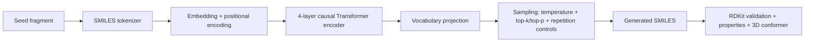

# Small-Molecule Design with a Transformer


[](https://small-molecule-design-using-transformer-model-fzvu6ve66dz8h8zf.streamlit.app)

Generate novel small molecules as SMILES strings with a Transformer-based PyTorch pipeline designed for molecular sequence modeling, RDKit validation, and interactive exploration. The project includes training, CLI generation, property estimation, and a Streamlit UI for fast experimentation.

> The model is specialized for autoregressive SMILES continuation: give it a fragment such as `C`, `N`, or `c1ccccc1`, sample the next tokens, then inspect chemical validity, QED, MW, LogP, and related metrics.

## What This Model Is Specialized For

- SMILES language modeling with causal masking so each token only attends to previous chemical context.
- Fragment-conditioned generation from short seeds, scaffold-like prompts, or partial SMILES prefixes.
- Safer sampling via `top_k`, `top_p`, repetition penalties, minimum new-token constraints, and invalid-molecule filtering.
- Chemistry-first postprocessing with RDKit validity checks, molecular descriptors, and dashboard visualization.
- Rapid ideation rather than full 3D or protein-conditioned design; 3D conformers are generated after sequence sampling.

## Technical Snapshot

| Item | Value |
| --- | --- |
| Model family | Causal Transformer encoder for autoregressive SMILES generation |
| Core implementation | `nn.TransformerEncoder` with causal mask, GELU activation, `norm_first=True`, and final `LayerNorm` |
| Tokenizer | Regex-based SMILES tokenizer with `<PAD>`, `<SOS>`, `<EOS>`, `<UNK>` |
| Dataset in repo | `249,455` SMILES strings in `data/smiles.txt` |
| Current training defaults | `d_model=256`, `nhead=8`, `num_layers=4`, `dim_feedforward=1024`, `max_len=60`, `dropout=0.2` |
| Attention head width | `32` dims per head |
| Approx. parameters (current architecture at `vocab_size=65`) | `3,192,897` |
| Inference controls | `temperature`, `top_k`, `top_p`, `repetition_penalty`, `min_new_tokens`, `max_repeat_run` |
| Validation stack | RDKit descriptors + Lipinski filtering logic in `src/property.py` |

## Parameter Breakdown

Current architecture parameter count, computed at `vocab_size=65` to match the packaged checkpoint metadata:

| Component | Parameters |
| --- | ---: |
| Token embedding | `16,640` |
| Transformer encoder stack | `3,159,552` |
| Output projection head | `16,705` |
| Total | `3,192,897` |

## Generation Pipeline



## Quick Start

### Install

```bash
pip install -r requirements.txt
```

### Launch the dashboard

```bash
python -m streamlit run streamlit_app.py
```

### Generate molecules

```bash
python src/generate.py --seed_token "N" --num_molecules 5 --temperature 0.8 --top_k 50 --top_p 0.95
```

### Generate with stronger anti-repetition controls

```bash
python src/generate.py --seed_token "C" --num_molecules 10 --temperature 0.85 --top_k 40 --top_p 0.92 --repetition_penalty 1.2 --min_new_tokens 8 --max_repeat_run 4
```

### Score a molecule

```bash
python src/property.py --smiles "c1ccccc1"
```

## Training

1. Place one SMILES string per line in `data/smiles.txt`.
2. Optionally preprocess with:

```bash
python src/load_zinc.py
```

3. Train the model:

```bash
python src/train.py --epochs 10 --batch_size 64 --max_len 60 --split_method scaffold --dedup
```

4. Optional runtime tuning for CPU-heavy environments:

```bash
python src/train.py --epochs 5 --batch_size 64 --num_workers 0 --no_pin_memory
```

<details>
<summary>Training defaults from <code>src/train.py</code></summary>

| Argument | Default |
| --- | --- |
| `epochs` | `20` |
| `lr` | `3e-4` |
| `batch_size` | `64` |
| `max_len` | `60` |
| `d_model` | `256` |
| `nhead` | `8` |
| `num_layers` | `4` |
| `dropout` | `0.2` |
| `val_split` | `0.1` |
| `split_method` | `scaffold` |
| `dedup` | `True` |
| `num_workers` | `2` |
| `pin_memory` | `True` on CUDA |
| `patience` | `8` |
| `min_delta` | `1e-4` |
| `weight_decay` | `1e-2` |
| `label_smoothing` | `0.05` |
| `checkpoint_name` | `best_model.pt` |

Training also uses `AdamW`, `OneCycleLR`, gradient clipping at `1.0`, and AMP automatically on CUDA.
</details>

<details>
<summary>Checkpoint compatibility note for technical users</summary>

The packaged `checkpoints/best_model.pt` contains metadata for an older decoder-style checkpoint, not the current encoder-style `src/model.py`. Its saved config is `d_model=256`, `nhead=8`, `num_layers=4`, `dim_feedforward=1024`, `max_len=100`, `dropout=0.3`, `vocab_size=65`, with `4,272,705` parameters in the saved state dict. If you want to use that checkpoint exactly as shipped, you need the matching older decoder model class; if you want to use the current code path, retrain and save a fresh checkpoint from the current architecture.
</details>

<details>
<summary>Notes for technical readers</summary>

- The model operates on linearized SMILES tokens, not molecular graphs.
- The tokenizer recognizes bracketed atoms, aromatic lower-case atoms, ring indices, bond symbols, and halogens such as `Cl` and `Br`.
- Scaffold-aware validation splitting in `src/train.py` is intended to reduce train/validation leakage from structurally similar compounds.
- 3D structures shown in the app are computed with RDKit after generation, not predicted directly by the network.
</details>
