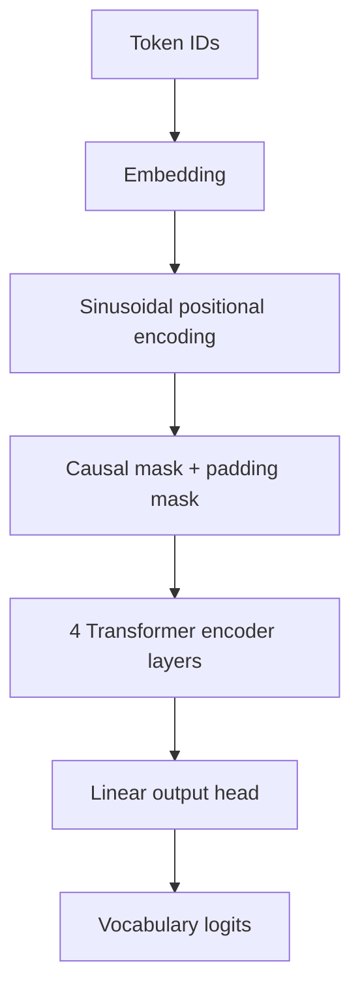

# Design Document: Small-Molecule Design with a Transformer

## 1. Project Purpose

This project is a molecular sequence-generation system built around SMILES strings, a Transformer model, RDKit-based validation, and a Streamlit application for interactive exploration.

The current system is designed to:

- learn SMILES syntax and local chemical motifs from a text corpus of molecules
- generate new candidate molecules autoregressively from a short seed fragment
- score generated molecules with standard RDKit descriptors
- visualize generated outputs in a lightweight web interface
- provide simple AI/ML analytics such as diversity, t-SNE chemical-space mapping, and nearest known-drug lookup

## 2. Scope

### In Scope

- SMILES tokenization and language modeling
- Transformer-based next-token prediction
- random or scaffold-aware train/validation/test splitting with reusable split artifacts
- RDKit validity and descriptor computation
- interactive molecule generation through Streamlit
- basic chemical-space analytics for generated batches

### Out of Scope

- target-aware drug design
- docking, binding affinity prediction, or QSAR modeling
- graph neural networks or 3D-native molecular generation
- synthesis planning or retrosynthesis
- medicinal chemistry decision support beyond simple heuristics

## 3. System Overview

```mermaid
flowchart LR
    A["data/smiles.txt"] --> B["Canonicalize + optional dedup"]
    B --> C["Random or scaffold train/val/test split"]
    C --> D["Save or reuse split artifacts"]
    D --> E["Regex SMILES tokenizer"]
    E --> F["SmilesDataset"]
    F --> G["DataLoader"]
    G --> H["Causal Transformer model"]
    H --> I["Cross-entropy training"]
    I --> J["Checkpoint + loss history"]
    J --> K["CLI + Streamlit inference"]
    K --> L["RDKit validation and descriptors"]
    L --> M["Offline evaluator + analytics dashboard"]
```

## 4. Repository Components

| File | Responsibility |
| --- | --- |
| `src/tokenizer.py` | Regex-based SMILES tokenization and vocab management |
| `src/dataset.py` | Converts tokenized SMILES into padded autoregressive training pairs |
| `src/model.py` | Causal Transformer encoder used for next-token prediction |
| `src/train.py` | End-to-end training loop with split logic, optimization, checkpointing, and split artifact management |
| `src/splits.py` | Canonicalization, deduplication, train/val/test split construction, and split save/load helpers |
| `src/generate.py` | Seeded autoregressive generation with safer sampling controls |
| `src/evaluate.py` | Offline generation evaluation with novelty, diversity, and held-out overlap reporting |
| `src/property.py` | RDKit-based validity checks and molecular descriptors |
| `src/analytics.py` | Diversity, t-SNE chemical-space projection, and known-drug similarity |
| `streamlit_app.py` | UI for generation, 3D visualization, and analytics |
| `data/smiles.txt` | Training corpus |
| `checkpoints/` | Saved model artifacts and training history |

## 5. Data Design

### Input Data

The project expects one SMILES string per line in `data/smiles.txt`.

Observed dataset size in the current repo:

- `249,455` lines in `data/smiles.txt`

### Preprocessing Strategy

Training-time preprocessing in `src/train.py` and `src/splits.py` includes:

- canonicalization with RDKit when available
- removal of invalid SMILES before splitting
- optional deduplication
- train/validation/test split using either:
  - `random`
  - `scaffold` based on Murcko scaffolds
- optional persistence of split artifacts for reproducible reruns

The default split method is scaffold-based to reduce structural leakage across training, validation, and test sets.

## 6. Tokenization Design

The tokenizer is SMILES-aware via regex matching rather than plain character splitting.

It supports:

- bracketed atoms such as `[C@H]`, `[NH+]`, `[C@@H]`
- aromatic atoms such as `c`, `n`, `o`
- halogens such as `Cl` and `Br`
- bond symbols and punctuation such as `=`, `#`, `/`, `\\`, `(`, `)`
- ring closure digits and `%NN` tokens

Special tokens:

- `<PAD>`
- `<SOS>`
- `<EOS>`
- `<UNK>`

This is a meaningful improvement over the older character-level design because multi-character chemical symbols remain intact.

## 7. Model Architecture

### Current Code Architecture

The current implementation in `src/model.py` is a causal Transformer encoder used autoregressively.

Core settings from the current training defaults:

| Hyperparameter | Value |
| --- | ---: |
| `d_model` | `256` |
| `nhead` | `8` |
| `num_layers` | `4` |
| `dim_feedforward` | `1024` |
| `max_len` | `60` |
| `dropout` | `0.2` |

Additional architectural details:

- sinusoidal positional encoding
- embedding scaling by `sqrt(d_model)`
- `nn.TransformerEncoderLayer`
- `activation="gelu"`
- `norm_first=True`
- final `LayerNorm`
- causal mask applied inside the forward pass
- padding mask support through `pad_token_id`

Approximate parameter count for the current encoder architecture at `vocab_size=65`:

- `3,192,897` parameters

### Model Flow

### Training Objective

The task is next-token prediction:

- input: `[SOS, t1, t2, t3, ...]`
- target: `[t1, t2, t3, ..., EOS]`

Loss:

- `CrossEntropyLoss`
- pad tokens ignored
- label smoothing enabled

## 8. Training Design

### Dataset Construction

`src/dataset.py` converts each tokenized SMILES sequence into:

- `input_ids = token_ids[:-1]`
- `target_ids = token_ids[1:]`

It also:

- pads sequences to `max_len + 1`
- truncates sequences longer than the configured limit
- skips empty or too-short samples

### Optimizer and Scheduling

The current training pipeline uses:

- `AdamW`
- `OneCycleLR`
- gradient clipping with `max_norm=1.0`
- AMP automatically on CUDA
- early stopping using validation loss

### Current Default Training Configuration

| Argument | Default |
| --- | ---: |
| `epochs` | `20` |
| `lr` | `3e-4` |
| `batch_size` | `64` |
| `max_len` | `60` |
| `dropout` | `0.2` |
| `val_split` | `0.1` |
| `test_split` | `0.1` |
| `patience` | `8` |
| `min_delta` | `1e-4` |
| `weight_decay` | `1e-2` |
| `label_smoothing` | `0.05` |
| `num_workers` | `2` |
| `split_method` | `scaffold` |
| `dedup` | `True` |
| `output_dir` | `checkpoints/` |
| `split_dir` | auto-generated under `data/splits/` |
| `reuse_split` | `False` |

### Training Outputs

Training writes:

- `<output_dir>/<checkpoint_name>` or a numbered variant when the requested path already exists
- optionally `<output_dir>/<checkpoint_stem>_last_model.pt`
- `<output_dir>/<checkpoint_stem>_loss_history.csv`
- `data/splits/<tag>/train.txt`
- `data/splits/<tag>/val.txt`
- `data/splits/<tag>/test.txt`
- `data/splits/<tag>/metadata.json`

## 9. Generation Design

### Inference Workflow

```mermaid
flowchart LR
    A["Seed fragment"] --> B["Tokenize and prepend SOS"]
    B --> C["Run Transformer on current prefix"]
    C --> D["Get final-step logits"]
    D --> E["Apply generation controls"]
    E --> F["Sample next token"]
    F --> G["Append token and repeat"]
    G --> H["EOS or max length"]
    H --> I["Decode SMILES"]
    I --> J["RDKit validation and properties"]
```

### Sampling Controls

The generator in `src/generate.py` includes:

- `temperature`
- `top_k`
- `top_p`
- `repetition_penalty`
- `min_new_tokens`
- `max_repeat_run`

It also blocks:

- `<PAD>`
- `<SOS>`
- `<UNK>`

And it can reject invalid molecules unless `--allow_invalid` is used.

## 10. Evaluation Design

`src/evaluate.py` provides an offline reporting path for generation quality.

It supports:

- validity rate
- uniqueness rate
- novelty against a training reference set
- overlap checking against a held-out test set
- diversity based on pairwise Tanimoto distance
- descriptor summaries including QED, MW, LogP, SA score, and TPSA

The evaluator can consume either:

- the default `data/smiles.txt` corpus
- explicit reference files
- a saved split directory produced by `src/train.py`

This makes the CLI evaluator the preferred path for report-style metrics, while the Streamlit app remains more exploratory.

## 11. Property and Chemistry Layer

`src/property.py` evaluates each generated SMILES using RDKit.

Computed outputs include:

- validity
- molecular weight
- LogP
- QED
- TPSA
- hydrogen-bond donors
- hydrogen-bond acceptors
- rotatable bonds
- ring count
- Lipinski pass/fail
- synthetic accessibility score when `sascorer` is available

This chemistry layer is a post-generation filter and scorer. It does not constrain the neural model during decoding.

## 12. Analytics and UI Design

### Streamlit Product Flow

The app provides:

- a seed input field
- number-of-molecules control
- temperature slider
- checkpoint selection from saved `.pt` files under `checkpoints/`
- result cards with SMILES and descriptor summaries
- on-the-fly 3D conformer generation using RDKit + `py3Dmol`

### Batch Analytics

The analytics layer computes:

- validity rate
- diversity score using pairwise Tanimoto distance
- average MW
- average LogP
- average QED
- Lipinski pass counts

### Chemical Space View

`src/analytics.py` computes:

- Morgan fingerprints with radius `2`
- fingerprint length `2048`
- t-SNE projection to 2D
- comparison between generated molecules and known-drug references

### Known-Drug Similarity

The app can compare generated molecules against `data/known_drugs.csv` using Tanimoto similarity and report top matches.

## 13. Current Implementation Note

The codebase is centered on a causal Transformer encoder trained autoregressively on SMILES data.

The current implementation also includes:

- deterministic train/validation/test split artifacts for reproducible experiments
- an offline evaluator for novelty and held-out overlap
- an interactive Streamlit app for qualitative inspection across multiple saved checkpoints

One practical caveat is that report-style novelty and held-out metrics still live mainly in the CLI evaluator, while the app remains lighter-weight and exploratory.

## 14. Limitations

- Generation is syntax-driven and not conditioned on target activity or assay outcomes.
- Chemical validity is checked after generation rather than enforced during decoding.
- The system models linearized SMILES, not graphs or 3D geometry directly.
- The Streamlit dashboard is intended for exploration; report-style metrics are handled mainly through the CLI evaluator.
- t-SNE plots are qualitative and depend on the sampled batch.
- No automated test suite currently guarantees model-checkpoint compatibility or end-to-end CLI stability.
- Relative and absolute checkpoint paths should both be exercised more thoroughly on Windows shells before public release.

## 15. Recommended Next Steps

- add automated tests for tokenizer, model loading, and generation
- align Streamlit analytics with CLI evaluation metrics such as uniqueness, novelty, and held-out overlap
- improve checkpoint and experiment-output isolation for repeated runs even further, especially if multiple users share the same workspace
- surface checkpoint metadata directly in the app
- add screenshot assets to make documentation and the project narrative stronger
